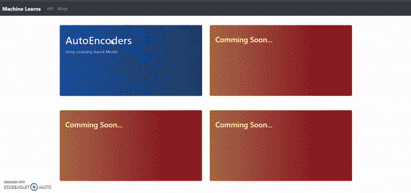
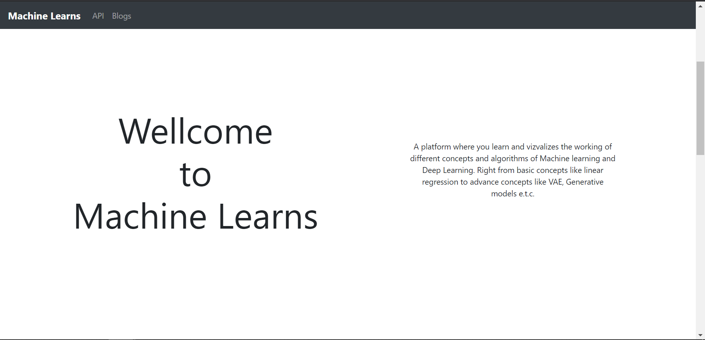
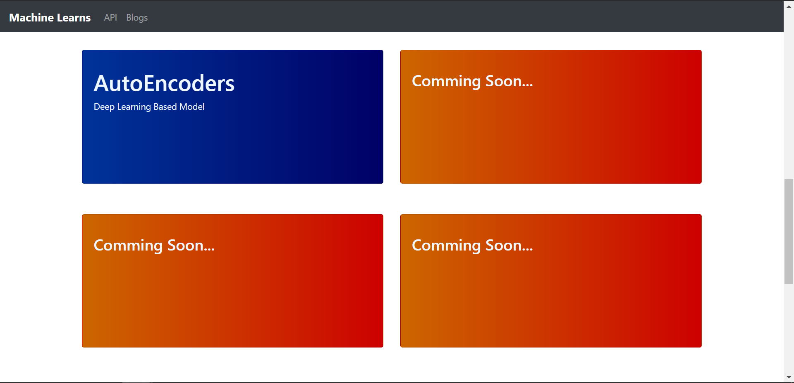
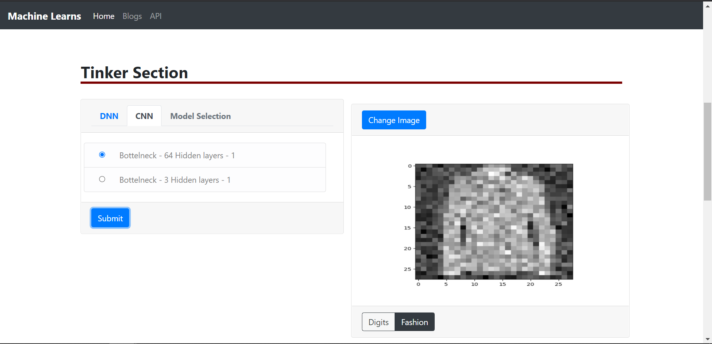
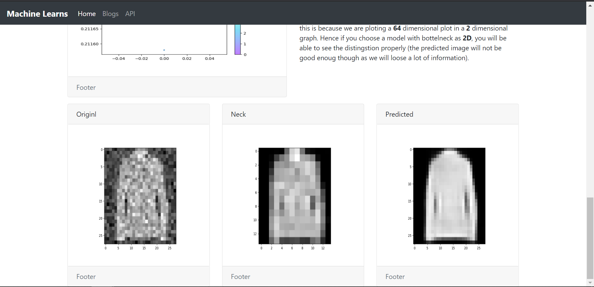

# <strong>Machine-Learns</strong>

<div align='center'>
    
</div>

<br>
<strong>

[Link to the Website --- Click here 👈](http://machine-learns.herokuapp.com/) <br>
**"Note" : because of free hosting service and heavy model hosted on Heroku, the website may take quite some time to open**

<strong>

<br>

<p>

<strong>

<p>

A platform where you learn and visualize the working of different concepts and algorithms of Machine Learning and Deep Learning. Right from basic concepts like linear regression to advanced concepts like VAE, Generative models, etc.

</p>

</strong>

</p>

<br><br>

<p>

It is an Interactive website where you can understand and play around with Machine Learning Concepts.
<br>

You will also find <strong>Blogs</strong> on different ML & AI Concepts. 
<p>

<br><br>

## <strong>Preview<strong>
---

<table>

<tr>
<td>
 
</td>
<td>
 
</td>
</tr>

<tr>
<td>
 
</td>
<td>
 
</td>
</tr>

</table>

<br>

## <strong>Getting Started<strong>

To run this project locally, follow these steps:

### Prerequisites

- Python 3.x
- Django
- Virtualenv (optional but recommended)

### Installation

1. **Clone the repository:**
   ```bash
   git clone https://github.com/yourusername/Machine-Learns.git
   cd Machine-Learns   ```

2. **Create a virtual environment (optional):**
   ```bash
   python -m venv venv
   source venv/bin/activate  # On Windows use `venv\Scripts\activate`   ```

3. **Install the required packages:**
   ```bash
   pip install -r requirements.txt   ```

4. **Apply migrations:**
   ```bash
   python manage.py migrate   ```

5. **Run the server:**
   ```bash
   python manage.py runserver   ```

6. **Access the application:**

   Open your web browser and go to `http://localhost:8000`.

### Notes

- Ensure you have the necessary data files in the `images` directory as specified in the `apps.py` file.
- If you encounter any issues with missing models, ensure they are placed in the `Api/Models` directory.

## <strong>Contributing<strong>

Contributions are welcome! Please feel free to submit a Pull Request.

## <strong>License<strong>

This project is licensed under the MIT License - see the [LICENSE](LICENSE) file for details.
